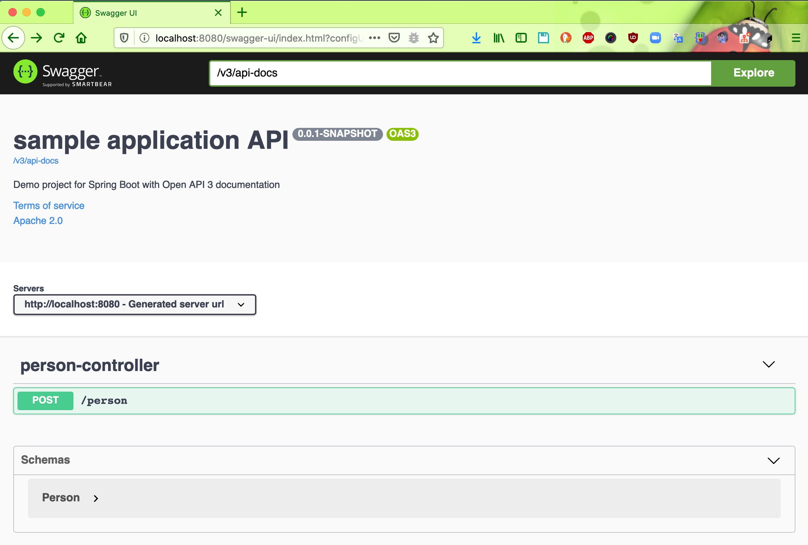
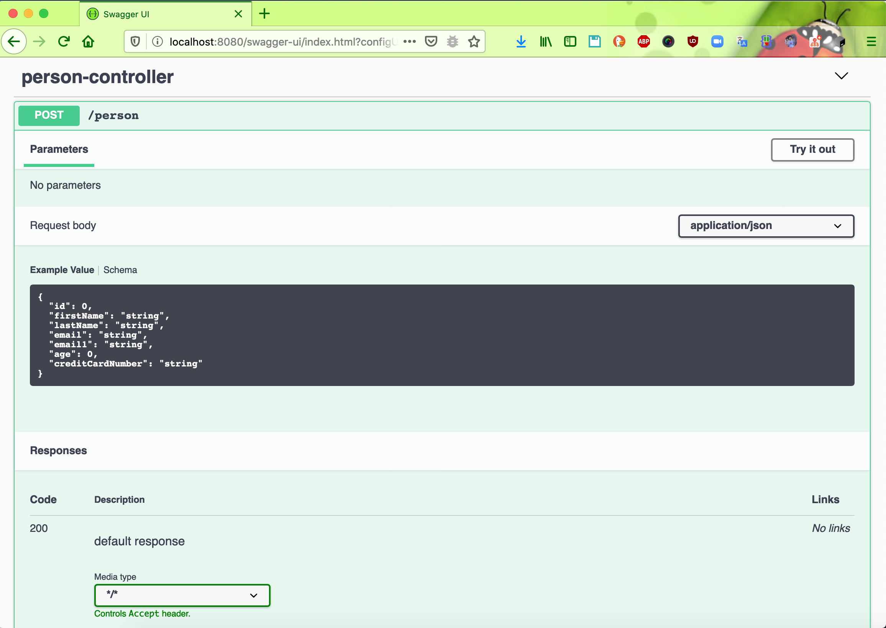
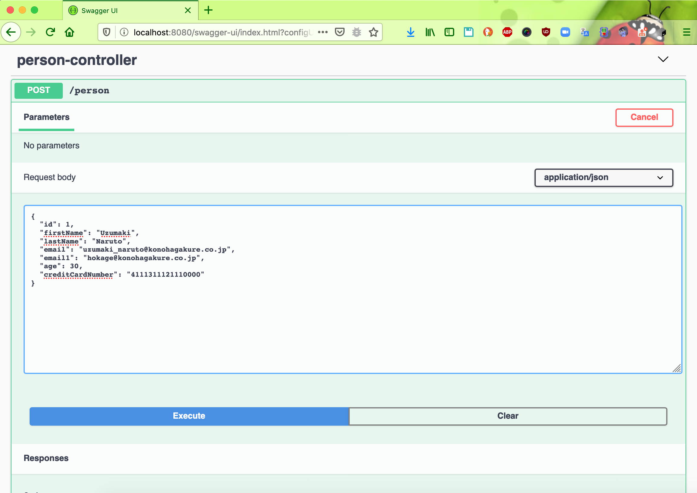
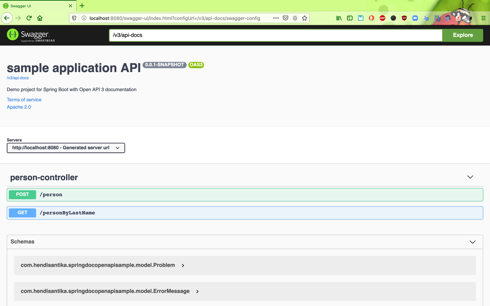
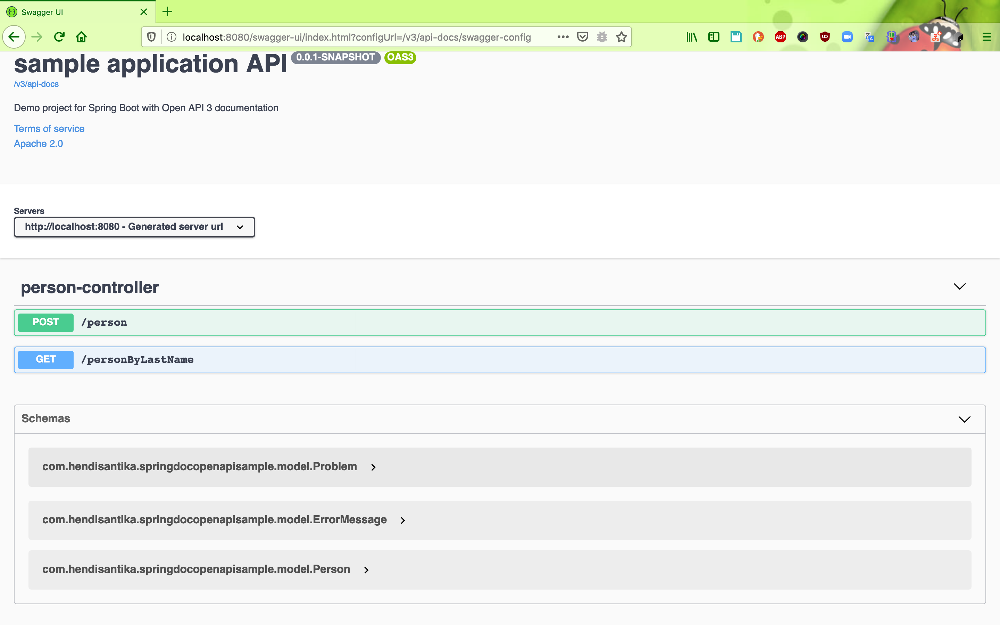

# springdoc-openapi-sample
### Things todo list:
1. Clone this repository: `git clone https://github.com/hendisantika/springdoc-openapi-sample.git`
2. Go inside the folder: `cd springdoc-openapi-sample`
3. Run the application: `mvn clean spring-boot:run`
4. Open your favorite browser: http://localhost:8080/swagger-ui.html

### Screen shot

Sample JSON
```json
{
  "id": 1,
  "firstName": "Uzumaki",
  "lastName": "Naruto",
  "email": "uzumaki_naruto@konohagakure.co.jp",
  "email1": "hokage@konohagakure.co.jp",
  "age": 30,
  "creditCardNumber": "4111311121110000"
}
```
Swagger UI Page



Swagger UI Page - API List



Swagger UI Page - API List 2



Swagger UI Page - API List 3



Swagger UI Page - API List 4

